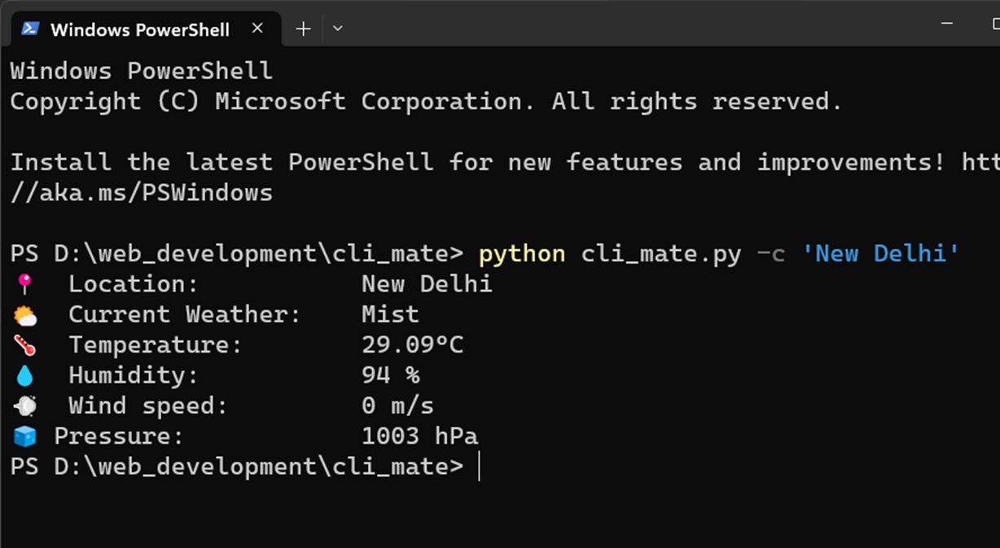
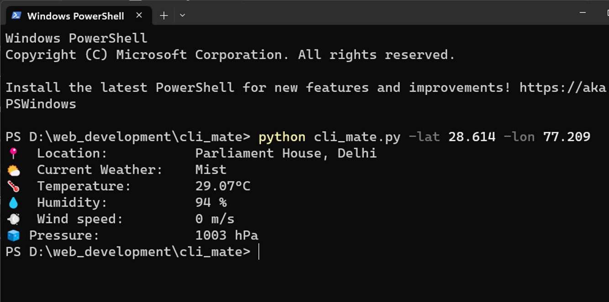
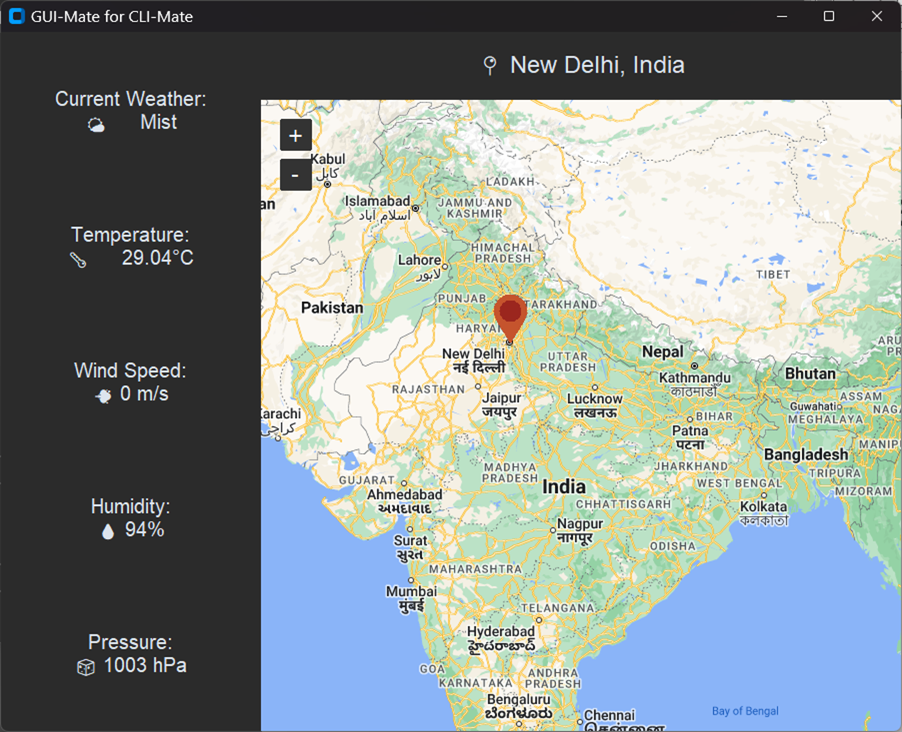
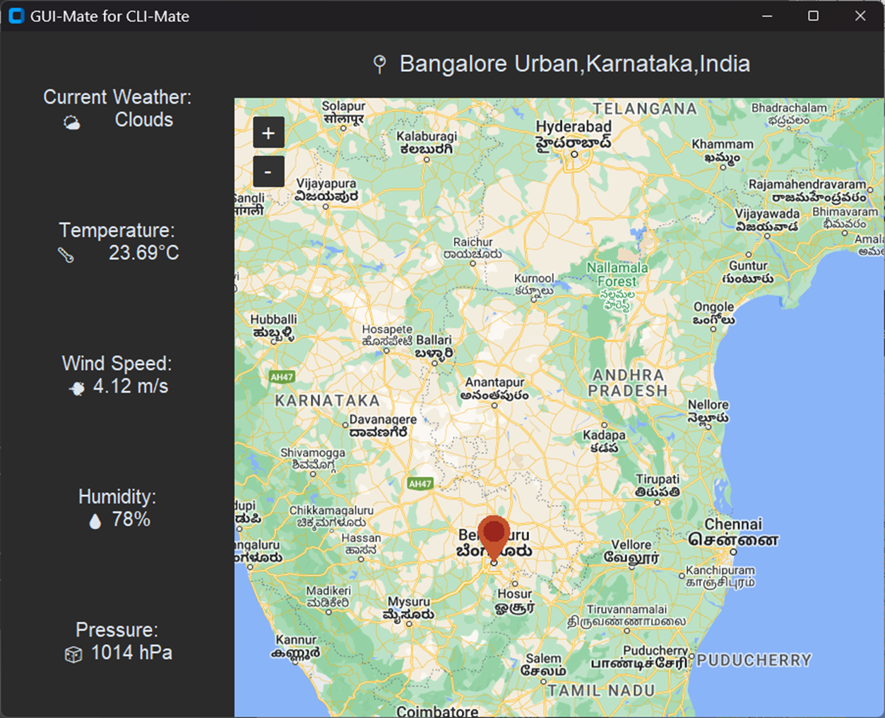

# CLI-Mate

This is a simple tool to get the weather information of a city using the [OpenWeatherMap](https://openweathermap.org/api) API.

You can use `CLI-Mate`, the CLI tool to get the weather updates using a `City Name` or the `Coordintes`, or use `GUI-Mate`, the GUI tool to get the weather information by using a `Map View`.

## Technologies used

* [OpenWeatherMap API](https://openweathermap.org/api) - To fetch the weather information.
* [CustomTkinter](https://github.com/TomSchimansky/CustomTkinter) - A modern and customizable python UI-library based on Tkinter.
* [TkinterMapView](https://github.com/TomSchimansky/TkinterMapView) - A python Tkinter widget to display tile based maps.
* [Github Copilot](https://copilot.github.com/) - To autocomplete and generate code.


## Installation

1. Clone the repository from Github

```shell
git clone https://github.com/hnhparitosh/cli_mate.git
```

2. Install the requirements

```shell
pip install -r requirements.txt
```

3. Get the API_KEY from [OpenWeatherMap](https://openweathermap.org/api) and set it in the `.env` file as `API_KEY`.

## Usage

### CLI with City Name

```shell
python cli_mate.py --city "New Delhi"
```

### CLI with Coordinates

```shell
python cli_mate.py --lat 28.6139 --lon 77.2090
```

### GUI

Just run the `gui_mate.py` file. 📍 Pin  and `location` on the `map`. The weather information will be displayed on the left side of the window.


## Screenshots

### Output of CLI using City Name



### Output of CLI using Coordinates



### GUI Demonstration





Please leave a ⭐ if you like this repository.